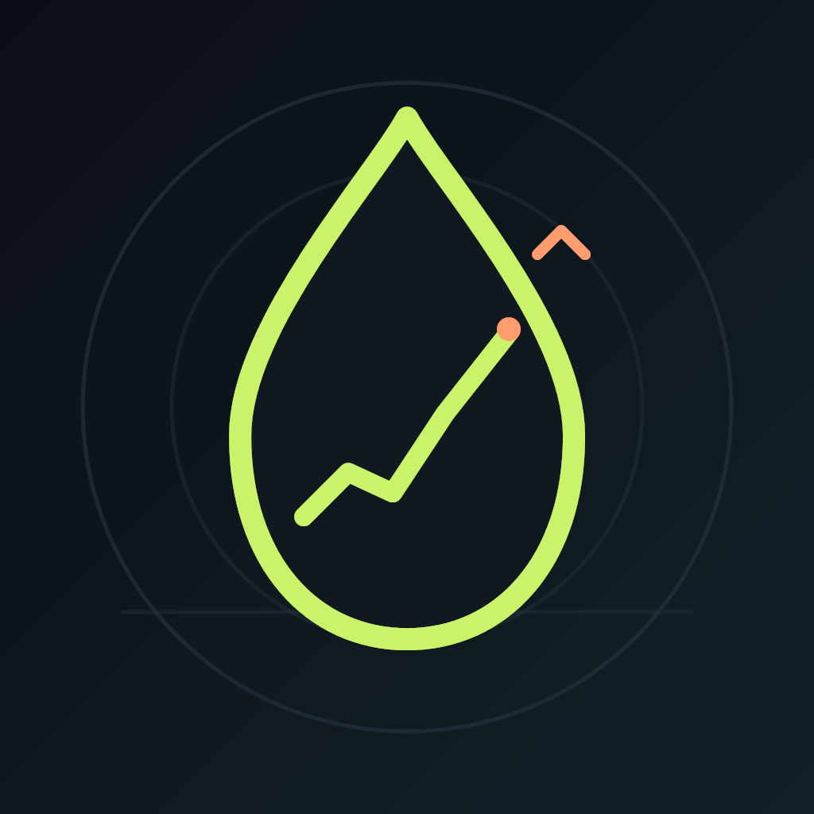
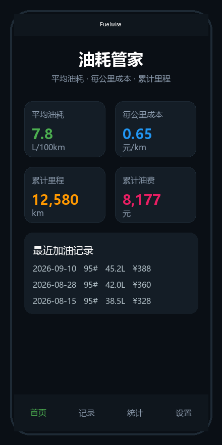
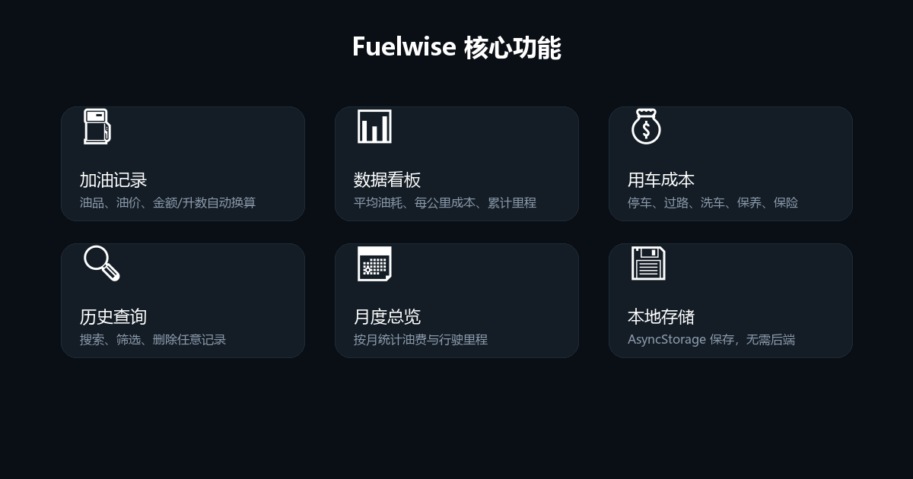

# Fuelwise 油耗管家

<p align="center">
  
</p>

<p align="center">
  <strong>一款简洁好用的汽车油耗与用车成本管理 App</strong><br>
  基于 Expo + React Native 开发，数据全部保存在手机本地，无需后端、无需注册。
</p>

---

## 📱 应用预览

<p align="center">
  
</p>

打开应用后，首页会直观展示：

- **平均油耗**：自动根据加油记录和里程计算
- **每公里成本**：帮助判断用车经济性
- **累计里程**：记录爱车总行驶里程
- **累计油费**：一目了然的总支出
- **最近加油记录**：快速查看历史记录

---

## ✨ 核心功能

<p align="center">
  
</p>

| 功能 | 说明 |
|------|------|
| ⛽ 加油记录 | 记录油品（92#/95#/98# 等）、油价、金额，金额与升数自动换算 |
| 📊 数据看板 | 实时展示平均油耗、每公里成本、累计里程、累计油费 |
| 💰 用车成本 | 除了油费，还可记录停车、过路、洗车、保养维修、保险车船税等 |
| 📅 月度总览 | 按月汇总油费、里程、其他支出，方便对比分析 |
| 🔍 历史查询 | 支持搜索、筛选、删除任意记录 |
| 💾 本地存储 | 所有数据通过 AsyncStorage 保存在手机本地，隐私安全 |

---

## 🛠 技术栈

- **[Expo](https://expo.dev/)** ~54：跨平台开发框架
- **[React Native](https://reactnative.dev/)** 0.81：原生级移动端体验
- **[expo-router](https://docs.expo.dev/router/introduction/)** ~6：文件系统路由
- **[React Native Reanimated](https://docs.swmansion.com/react-native-reanimated/)** ~4：流畅动画
- **[AsyncStorage](https://react-native-async-storage.github.io/async-storage/)**：本地持久化存储
- **TypeScript**：类型安全的开发体验

---

## 🚀 快速开始

### 环境要求

- Node.js 18 或更高版本
- npm 或 yarn
- 手机安装 [Expo Go](https://expo.dev/go)（开发预览用）

### 本地运行

```bash
# 1. 克隆仓库
git clone https://github.com/jiachenleo9-create/fuelwise.git
cd fuelwise

# 2. 安装依赖
npm install

# 3. 启动开发服务器
npx expo start
```

启动后，使用 Expo Go 扫描终端显示的二维码即可在手机上预览。手机和电脑需处于同一局域网。

---

## 📁 项目结构

```
fuelwise/
├── app/                    # 页面路由（expo-router）
│   ├── index.tsx           # 首页（数据看板 + 最近记录）
│   └── _layout.tsx         # 根布局
├── assets/images/          # 图标、启动图、预览图
├── lib/                    # 工具函数与数据存储
│   └── storage.ts          # AsyncStorage 封装
├── app.json                # Expo 配置（应用名称、图标、包名等）
├── eas.json                # EAS Build 构建配置
├── package.json            # 项目依赖
└── README.md               # 本文件
```

---

## 📦 构建安装包

项目已配置 GitHub Actions，可自动构建 Android debug APK。

### 在线构建（推荐）

1. 打开仓库的 [Actions](https://github.com/jiachenleo9-create/fuelwise/actions) 页面
2. 选择 **Build Android APK** 工作流
3. 点击 **Run workflow** 手动触发
4. 等待构建完成（约 5–15 分钟）
5. 在 Artifacts 或 Release 中下载 `fuelwise-debug-apk`

### 使用 EAS Build（正式包）

如果你已有 Expo 账号，也可以使用 EAS 构建更正式的安装包：

```bash
npm install -g eas-cli
eas build --platform android --profile preview
```

构建完成后，EAS 会提供下载链接，可直接发送到手机安装。

> ⚠️ 当前自动生成的是 **debug APK**，可直接在 Android 手机上安装测试。如需发布到应用商店，需要配置签名证书并构建 release 版本。

---

## 💾 数据与隐私

- 所有数据均存储在手机本地，不会上传到任何服务器
- 卸载应用或清除数据会导致记录丢失，建议定期导出重要数据
- 未来可考虑增加数据导出/导入功能（CSV 或 JSON）

---

## 📝 更新日志

| 版本 | 说明 |
|------|------|
| 1.0.0 | 初始版本：加油记录、数据看板、用车成本、月度总览、历史查询 |

---

## 🤝 贡献

欢迎提交 Issue 或 Pull Request！

如果你有任何功能建议或 Bug 反馈，可以在 [Issues](https://github.com/jiachenleo9-create/fuelwise/issues) 页面提出。

---

## 📄 许可证

本项目仅供学习和个人使用。
